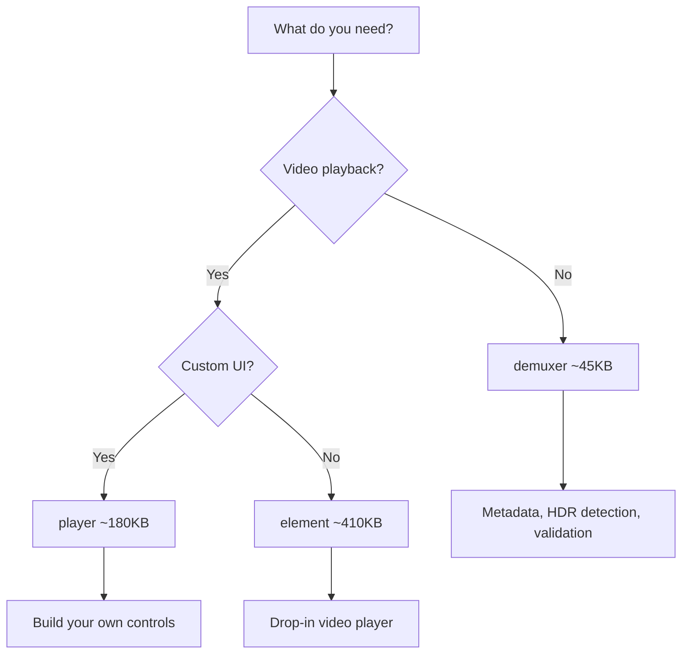

# Modules

Movi-Player is designed with modularity in mind. Use only what you need.

## Module Overview

| Module      | Import Path           | Size   | Gzip    | Brotli  | Use Case                                |
| ----------- | --------------------- | ------ | ------- | ------- | --------------------------------------- |
| **Demuxer** | `movi-player/demuxer` | ~45KB  | 2.31 MB | 1.74 MB | Metadata, HDR detection, packet reading |
| **Player**  | `movi-player/player`  | ~180KB | 2.52 MB | 1.91 MB | Playback control, custom UI             |
| **Element** | `movi-player` / `movi-player/element` | ~410KB | 2.57 MB | 1.95 MB | Full UI player (drop-in)                |
| **Element (slim)** | `movi-player/element/slim` | ~410KB | 1.00 MB + WASM | 750 KB + WASM | Same player, WASM as a separate file |

> Module sizes (first column) exclude the embedded WASM binary. Gzip/Brotli columns show the total transfer size including WASM. Enable Brotli compression on your server for optimal delivery.

## Demuxer Module (~45KB)

Use when you only need metadata extraction without playback.

```typescript
import { Demuxer, HttpSource, FileSource } from "movi-player/demuxer";
```

### Exports

| Export                 | Type    | Description               |
| ---------------------- | ------- | ------------------------- |
| `Demuxer`              | Class   | Media file demuxer        |
| `HttpSource`           | Class   | HTTP source adapter       |
| `FileSource`           | Class   | Local file source adapter |
| `ThumbnailHttpSource`  | Class   | Optimized for thumbnails  |
| `MoviVideoDecoder`     | Class   | WebCodecs video decoder   |
| `MoviAudioDecoder`     | Class   | WebCodecs audio decoder   |
| `SubtitleDecoder`      | Class   | Subtitle parser           |
| `SoftwareVideoDecoder` | Class   | Fallback video decoder    |
| `SoftwareAudioDecoder` | Class   | Fallback audio decoder    |
| `CodecParser`          | Class   | Codec string utilities    |
| `WasmBindings`         | Class   | Low-level FFmpeg bindings |
| `LRUCache`             | Class   | Cache implementation      |
| `Logger`, `LogLevel`   | Utility | Logging                   |
| `Time`, `TIME_BASE`    | Utility | Time conversions          |
| `EventEmitter`         | Class   | Event handling            |

### Use Cases

- ✅ Extract video metadata (duration, resolution, codec)
- ✅ Detect HDR content (colorPrimaries, colorTransfer)
- ✅ List audio/subtitle tracks with languages
- ✅ Video file validation
- ✅ Read packets for custom processing
- ❌ No playback
- ❌ No rendering

### Example

```typescript
import { Demuxer, HttpSource } from "movi-player/demuxer";

async function getVideoInfo(url: string) {
  const source = new HttpSource(url);
  const demuxer = new Demuxer(source);

  const info = await demuxer.open();

  const video = demuxer.getVideoTracks()[0];
  const audio = demuxer.getAudioTracks();
  const subtitles = demuxer.getSubtitleTracks();

  const result = {
    format: info.formatName,
    duration: info.duration,
    video: video
      ? {
          codec: video.codec,
          resolution: `${video.width}x${video.height}`,
          frameRate: video.frameRate,
          isHDR: video.isHDR,
        }
      : null,
    audioTracks: audio.length,
    subtitleTracks: subtitles.length,
  };

  demuxer.close();
  return result;
}
```

## Player Module (~180KB)

Use when you need full playback control without the built-in UI.


```typescript
import { MoviPlayer, LogLevel } from "movi-player/player";
```

### Exports

Includes everything from `demuxer` module, plus:

| Export               | Type  | Description            |
| -------------------- | ----- | ---------------------- |
| `MoviPlayer`         | Class | Main player class      |
| `CanvasRenderer`     | Class | WebGL2 canvas renderer |
| `AudioRenderer`      | Class | Web Audio renderer     |
| `TrackManager`       | Class | Track management       |
| `Clock`              | Class | A/V sync clock         |
| `PlayerStateManager` | Class | State machine          |
| `PlaybackController` | Class | Playback orchestration |

### Use Cases

- ✅ Build custom player UI
- ✅ Canvas-based video rendering
- ✅ Thumbnail/preview generation
- ✅ Multi-player instances
- ✅ Headless video processing
- ✅ Frame-by-frame control
- ❌ No built-in controls

### Example

```typescript
import { MoviPlayer, LogLevel } from "movi-player/player";

MoviPlayer.setLogLevel(LogLevel.ERROR);

const canvas = document.getElementById("canvas") as HTMLCanvasElement;
const player = new MoviPlayer({
  source: {
    type: "url",
    url: "video.mp4",
  },
  canvas: canvas,
  renderer: "canvas",
  decoder: "auto",
});

// Event listeners
player.on("loadEnd", () => console.log("Ready!"));
player.on("stateChange", (state) => updateUI(state));
player.on("error", (e) => console.error(e));

// Load and control
await player.load();
await player.play();

// Build your own controls
document.getElementById("playBtn").onclick = () => player.play();
document.getElementById("pauseBtn").onclick = () => player.pause();
document.getElementById("seekBar").oninput = (e) => {
  player.seek(parseFloat(e.target.value));
};
```

## Element Module (~410KB)

Complete drop-in video player with built-in UI.

```typescript
import "movi-player";
```

### Exports

Registers the `<movi-player>` custom element. Includes everything from `player` module, plus:

- Custom Element (Web Component)
- Built-in controls UI
- Touch/mouse gestures
- Context menu
- Keyboard shortcuts
- Theming support
- Auto-scaling

### Use Cases

- ✅ Drop-in `<video>` replacement
- ✅ Zero configuration
- ✅ Built-in controls
- ✅ Mobile-friendly gestures
- ✅ Keyboard navigation
- ✅ Quick prototypes

### Example

```html
<script type="module">
  import "movi-player";
</script>

<movi-player
  src="video.mp4"
  controls
  autoplay
  muted
  style="width: 100%; height: 500px;"
></movi-player>
```

## Slim Element Module

The same `<movi-player>` element and the exact same API as `movi-player/element` —
only how the WASM ships differs. The default build embeds the FFmpeg WASM inside
the JS (11.4 MB of JS); the slim build keeps it as a separate `movi.wasm`
(4.2 MB JS + 5.6 MB WASM), so the engine streams and compiles as a cacheable
asset instead of a base64 blob, and the JS parses far faster.

```typescript
import "movi-player/element/slim";
```

Two things to know:

1. **You must host `movi.wasm` yourself.** It ships in the package at
   `movi-player/dist/movi.wasm`. Bundlers that understand
   `new URL("movi.wasm", import.meta.url)` (Vite, webpack 5, Parcel 2) emit it
   automatically; otherwise copy it next to your JS bundle, or point at it with
   [`wasmurl`](/api/element#wasmurl).
2. **Native fallback is automatic.** Because a consumer may not host the extra
   `.wasm`, a source the WASM engine can't open falls through to the browser's
   own `<video>` (wrapped in the player's controls) with no `fallback="native"`
   attribute needed. HLS/DASH play via Shaka without the WASM regardless.

```html
<script type="module">
  import "movi-player/element/slim";
</script>

<!-- movi.wasm hosted somewhere else? point at it -->
<movi-player
  src="video.mkv"
  wasmurl="https://cdn.example.com/movi-player/movi.wasm"
  controls
></movi-player>
```

### With a framework wrapper

Every wrapper has a `/slim` twin — same components, same props, same events:

| Framework | Default | Slim |
| --- | --- | --- |
| React | `movi-player/react` | `movi-player/react/slim` |
| Vue 3 | `movi-player/vue` | `movi-player/vue/slim` |
| Svelte | `movi-player/svelte` | `movi-player/svelte/slim` |

```jsx
import { MoviPlayer } from "movi-player/react/slim";

<MoviPlayer src="video.mkv" controls wasmurl="/movi.wasm" />;
```

```vue
<script setup>
import { MoviPlayer } from "movi-player/vue/slim";
</script>

<template>
  <MoviPlayer src="video.mkv" controls wasmurl="/movi.wasm" />
</template>
```

```svelte
<script>
  import MoviPlayer from "movi-player/svelte/slim";
</script>

<MoviPlayer src="video.mkv" controls wasmurl="/movi.wasm" />
```

Import one or the other, not both: whichever loads second finds `<movi-player>`
already defined, so it registers nothing while still shipping its own copy of
the engine.

## Module Composition

```
demuxer (~45KB)
├── FFmpeg WASM bindings
├── Container parsing (MP4, MKV, WebM, etc.)
├── Metadata extraction
├── Track enumeration
├── HDR detection
├── Packet reading
├── Source adapters (HTTP, File)
└── Codec parsers

player (~180KB) = demuxer +
├── MoviPlayer orchestrator
├── WebCodecs video decoder
├── WebCodecs audio decoder
├── Software decoder fallbacks
├── CanvasRenderer (WebGL2)
├── AudioRenderer (Web Audio)
├── TrackManager
├── Clock (A/V sync)
├── PlaybackController
└── State management

element (~410KB) = player +
├── <movi-player> Custom Element
├── Controls UI (play, seek, volume, fullscreen)
├── Touch gesture handler
├── Mouse gesture handler
├── Context menu
├── Settings panel
├── Theming engine
└── Keyboard shortcuts
```

## Tree Shaking

Movi-Player supports tree shaking. Unused exports are removed:

```typescript
// Only imports Demuxer and HttpSource
// ~45KB after tree shaking
import { Demuxer, HttpSource } from "movi-player/demuxer";

// Only what you use is bundled
const demuxer = new Demuxer(new HttpSource(url));
```

## CDN Usage

Use specific modules via CDN:

```html
<!-- Full element (recommended for quick start) -->
<script type="module">
  import "https://unpkg.com/movi-player@latest/dist/element.js";
</script>

<!-- Slim element: WASM streams from movi.wasm next to the JS -->
<script type="module">
  import "https://unpkg.com/movi-player@latest/dist/element.slim.js";
</script>

<!-- Player only (for custom UI) -->
<script type="module">
  import { MoviPlayer } from "https://unpkg.com/movi-player@latest/dist/player.js";
</script>

<!-- Demuxer only (for metadata) -->
<script type="module">
  import {
    Demuxer,
    HttpSource,
  } from "https://unpkg.com/movi-player@latest/dist/demuxer.js";
</script>
```

## Decision Guide



| Scenario                   | Recommended Module    |
| -------------------------- | --------------------- |
| Video upload validation    | `demuxer`             |
| HDR detection service      | `demuxer`             |
| Video metadata API         | `demuxer`             |
| Custom player UI           | `player`              |
| Video editing timeline     | `player`              |
| Video thumbnail generation | `player`              |
| Simple video playback      | `element`             |
| Quick prototype            | `element`             |
| Streaming platform         | `element` or `player` |

## Combining Modules

You can import from multiple modules, but avoid duplicates:

```typescript
// ✅ Good - import from most specific module
import { Demuxer, HttpSource } from "movi-player/demuxer";
import { MoviPlayer } from "movi-player/player";

// ❌ Avoid - don't import same thing from different paths
// import { Demuxer } from 'movi-player/demuxer';
// import { Demuxer } from 'movi-player/player';  // Same class, duplicated
```

### Pre-check Before Playback

```typescript
import { Demuxer, HttpSource } from "movi-player/demuxer";
import { MoviPlayer } from "movi-player/player";

// Quick metadata check with demuxer
async function isValidVideo(url: string): Promise<boolean> {
  const demuxer = new Demuxer(new HttpSource(url));

  try {
    await demuxer.open();
    const hasVideo = demuxer.getVideoTracks().length > 0;
    demuxer.close();
    return hasVideo;
  } catch {
    return false;
  }
}

// Full playback with player
async function play(url: string, canvas: HTMLCanvasElement) {
  if (!(await isValidVideo(url))) {
    throw new Error("Invalid or unsupported video");
  }

  const player = new MoviPlayer({
    source: { type: "url", url },
    canvas,
  });

  await player.load();
  await player.play();

  return player;
}
```
